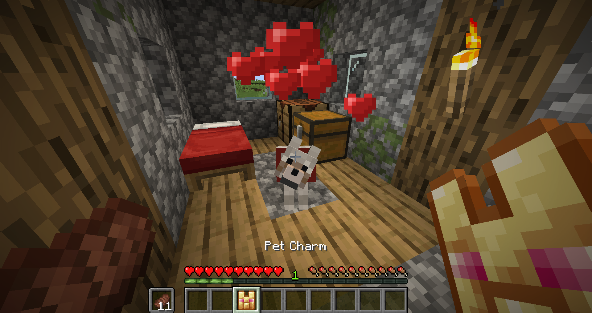

&emsp;&emsp;&emsp;&emsp;&emsp;&emsp;&emsp;&emsp;

> **This mod adds a pet charm that you can use to protect your pets from death. Unbalanced, but good for animal lovers! ❤**

> Right click a pet mob with the charm (whitelist configurable via tag) to make them invincible. Subsequent uses of the charm teleport the bound pet back to you. In the event the game cannot find the mob, or it falls out of the world the charm with re-summon it with the last saved data.

> **NOTE:** This mod was intened for a modpack server I play on. The charm isn't avalible in survival by default, but you can add a loottable or recipe if desired.
